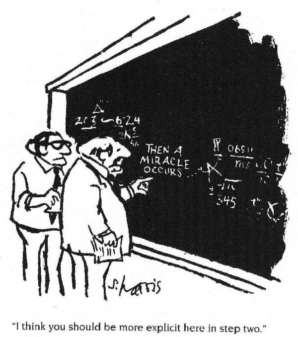

# Why is this course important?

As modern researchers, we should care about ***reproducible research***. At some point in the future, someone, somewhere, might want to repeat your analysis for themselves or re-use your data. Not because they don't trust your results, but they might want to use your approach to validate their own findings or understand your methods. Assuming that you'll be able to remember all the steps involved is dangerous, so making sure that everything is well-documented is key. The documentation involves not only the methods used, but the files used as input and any transformations performed on them. 

Florian Markowetz has a great talk on why we should work reproducibly and there is a [Genome Biology paper](http://genomebiology.biomedcentral.com/articles/10.1186/s13059-015-0850-7) that you should read.

Two key areas that we will address in this course are:-

1. Making sure the analysis can be automated
2. Making your data available to others

Hopefully you will take the opportunity to learn a course to learn a language such as [R](http://cambiotraining.github.io/r-intro/) or [Python](http://pycam.github.io/) for your data analysis. From experience, the biggest hurdle that newcomers to these languages face is when trying to read and analyse your own data after the course. Often not because you have not understood the course materials, but because the data have been managled into a form that the computer cannot process. As we're all busy people, at this point there's a danger of becoming de-motivated and resorting back to whatever software you were using before.

Of course, you might not be performing the Bioinformatics analysis yourself. Bioinformaticians are very-skilled in the art of 'data munging' or 'data wrangling' and all the errors in files that we will discuss have a solution in software such as R. But would you rather they spend their time analysing the data, or manipulating it?

# When do we have to worry about such things?

***From the very beginning!*** Creating documentation for our data and keeping things tidy may seem tedious, but trying to pull everything together for a paper submission is an extremely painful process.

# What kind of data disasters can we avoid?

- Total destruction of data
- Inability to find data
- Corruption of data
- Forgetting what the data mean
- Inability to reproduce the data

# Are spreadsheets programs like Excel bad?

Not neccesarily. It is often much more convenient to eye-ball a spreadsheet and get an overall impression of your data. But they have *limitations* making them not ideal for large-scale analyses. Doing things by-hand only invites you to make copy-and-paste errors. For example, here is a classic "off-by-one" error

This example comes from probably the most (in)famous example of failure to reproduce a study, which actually *put people's lives at risk*. [Keith Baggerly's lecture](https://youtu.be/7gYIs7uYbMo) on the scandal is a ***must-see***.

Your carefully-crafted, colourful, all-singing, all-dancing, multi-tab spreadsheet probably won't read very easily into R. By all means create a spreadsheet for your own benefit, but don't treat it as the same data that are analysed. Computers are very literal **don't make any assumptions about the data**. They won't be able to tell the difference between the text entries `MALE` and `male`, `Male`. You must be consistent in how you enter the data. Nor can they discern colours or other types of formatting in the data. 

Unfortunately, at some points in the analysis process spreadsheets are *unavoidable*. Typically, you will have a set of biological samples that you wish to investigate. The ***metadata*** for the experiment is the means to describe what biological group each sample belongs to and other useful information such as the conditions under which each sample was derived (batch, cage) and other characteristics (sex, age) that might influence the analysis.

We will introduce  [Open Refine](http://openrefine.org/), *a free open source, powerful tool for working with messy data* that can help to transform data.

# General Principles

1) **Ensure you have a secure backup strategy**

Should be self-explanatory!

2) **Never work directly on the raw data**

[http://www.inquisitr.com/309687/jesus-painting-restoration-goes-wrong-well-intentioned-old-lady-destroys-100-year-old-fresco/](http://www.inquisitr.com/309687/jesus-painting-restoration-goes-wrong-well-intentioned-old-lady-destroys-100-year-old-fresco/)

3) **Keep track the files in your project**

4) **Embrace version control**

Doesn't need to be involve a sophisticated software solution

5) **Make sure your files are amenable for analysis**

We will discuss this point in more detail in the next section.

# References

- [Data carpentry workshops](http://lgatto.github.io/2016-05-16-CAM/)
- [The Quartz guide to bad data](https://github.com/Quartz/bad-data-guide/blob/master/README.md)
- [Three common bad practices in sharing tables and spreadsheets and how to avoid them.](http://luisdva.github.io/pls-don't-do-this/)
- [The Data Organisation tutorial by Karl Broman](http://kbroman.org/dataorg/)
- [Biologists: this is why bioinformaticians hate you...](http://www.opiniomics.org/biologists-this-is-why-bioinformaticians-hate-you/)

# Acknowledgments

- Anne Pajon
- Andy Lynch

