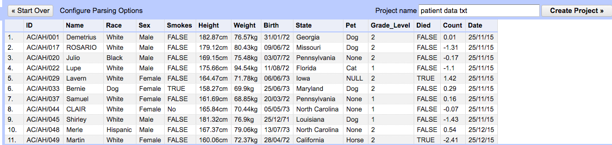

```{r setup, include=FALSE}
knitr::opts_chunk$set(echo = TRUE)
```


# Open refine demo

(adapted from [Data Carpentry materials](http://lgatto.github.io/OpenRefine-ecology/00-getting-started.html))

Open Refine (previously Google Refine) is an open-source tool that can help you to clean-up messy datasets. It presents itself as a spreadsheet-like interface, but all operations we do to the data are recorded and can be repeated or reversed. We will show how it can be used to solve some of the issues we have highlighted previously. You can use Open Refine to build-up a data-cleaning pipeline which you can apply to multiple files. We will not go that far today though. There are some nice introductory videos

<iframe width="560" height="315" src="https://www.youtube.com/embed/B70J_H_zAWM" frameborder="0" allowfullscreen></iframe>

<iframe width="560" height="315" src="https://www.youtube.com/embed/cO8NVCs_Ba0" frameborder="0" allowfullscreen></iframe>

Open Refine runs in a web browser, although you do not have to be online to use it.

## Some example data

We will use some data that have been simulated to demonstrate many of the problems we have seen already. Each row represents a different patient in a fictitious study and can be downloaded from the [course website](https://raw.githubusercontent.com/bioinformatics-core-shared-training/avoid-data-disaster/master/patient-data.txt). (Right-click and `Save Link as....`) 

## Importing the data

Start the program. On Windows, Double-click on the openrefine.exe file. Java services will start on your machine, and Refine will open in your Firefox browser. On the Mac, you've probably installed the package into your Applications folder.

Note the file types Open Refine handles: TSV, CSV, *SV, Excel (.xls .xlsx), JSON, XML, RDF as XML, Google Data documents. Support for other formats can be added with Google Refine extensions.

Once Refine is open, you’ll be asked if you want to Create, Open, or Import a Project.

- Click ***Browse***, find `patient-data.txt`
- Click ***next*** to open `patient-data.txt`
Refine gives you a preview - a chance to show you it understood the file. If, for example, your file was really comma-separated, the preview might look strange, you would choose the correct separator in the box shown and click “update preview.”
- You should see something like...



If all looks well, click ***Create Project***.

## Faceting

*Faceting* provides you a snapshot of the entries in a particular column and allows you to filter down to particular rows. It can also quickly highlight problems with the data.

Typically, you create a facet on a particular column. The facet summarizes the cells in that column to give you a big picture on that column, and allows you to filter to some subset of rows for which their cells in that column satisfy some constraint. That’s a bit abstract, so let’s jump into some examples. Before we start, ***how many different entries would we expect to find a column that is supposed to be just `Male` or `Female`?***


- Scroll over to the `Sex` column
- Click the down arrow and choose ***Facet*** -> ***Text facet***
- In the left margin, you’ll see a box containing every unique, distinct value in the `Sex` column and Refine shows you how many times that value occurs in the column (a count), and allows you to sort (order) your facets by name or count.

In this case, we have found ***6*** different ways for Male or Female to be entered. 


Edit. Note that at any time, in any cell of the Facet box, or data cell in the Refine window, you have access to edit and can fix an error immediately. Refine will even ask you if you’d like to make that same correction to every value it finds like that one (or not).

## Trimming whitespace

*Whitespace* is when we have a blank space at the beginning, or end, of a text entry. They can be difficult to spot by-eye and for the computer ` Male` and `Male` are completely distinct entries. This can have undesired consequences in a data analysis.

```{r echo=FALSE}
library(stringr)
patients <- read.delim("patient-data.txt")
ht <- as.numeric(str_replace_all(patients$Height,"cm", ""))
boxplot(ht ~ patients$Sex,las=2,ylab="Height")
```

Fortunately, Open Refine has a straightforward solution to this problem

- Select the `Sex` column
- Select ***Edit cells***
- ***Common transforms*** -> ***Trim trailing and leading whitespace***

Now try the text facet operation from above. What do you notice?

## Clustering

*Clustering* in Open Refine is used to identify and consolidate similar entries into a consistent term. We could have actually used this in the previous example as ` Male`, ` Male ` and `Male` are essentially representing the same thing. Let's try this on the `Pet` column. The first thing we will notice is that `Cat` and `CAT` are distinct entries but probably shouldn't be. We can fix that by clustering

- Select the `Pet` colum
- ***Facet*** -> ***Text Facet*** as before
- Now, click the ***cluster*** button in the top-right of the panel that shows you all the different values in this column.
- It will now suggest various groups of entries that it thinks represent the same thing. You can click the checkbox to merge into a single group and have the ability to choose the new name.
- Clicking ***Merge Selected and Close*** will perform the operation

## Bulk-editing

Staying with the `Pet` column, there is also an inconsistent way of representing missing data; with `NA`, `None` or `NULL` used. Languages such as R would prefer `NA` to be used, although in practice we can use any as long as we are consistent.

- Click on `None` in the Facet panel. Only rows where the value of `Pet` is `None` will be shown.
- Click on the ***edit*** box `None` value in any particular row. This will give you the chance to edit the value.
- Change the value to `NA`. Clicking ***Apply to all identical cells*** will change all occurences of `None` to `NA`.
- You could also try changing `NULL`...

## Splitting into several columns

Sometimes multiple pieces of information can be encoded in a single cell. In our particular case, the ID assigned to each patient contains a hospital identifier (either `AH` or `SG`) and a numeric ID. For some analyses we might want to quickly perform operations that take the hospital as a factor

- Select the `ID` column
- ***Edit column*** -> ***Split into several columns***
- It will ask you what text character splits the IDs into different parts. In this case we specify `/`
- Each new column is assigned a new name automatically. You can change the names by ***Edit column*** -> ***Rename this column***

## Filling missing values

The final column `Date entered study` was used to indicate the date at which each patient was enrolled onto the study in question. Patients were enrolled in batches. However, the person filling out the form thought it was helpful to include this information only once for each batch of new patients. 

- Select the `Date Entered Study` column
- Select ***Edit cells*** -> ***Fill down***
- Empty cells will now be filled with the appropriate date. 

## Upper- and lower-case transformations

For consistency, we might want the text entries in a particular column to be all `lower` or `UPPPER` case. 

- Select the `Name` column
- ***Edit column*** -> ***Common transformations***
- You can choose `To uppercase`, `To lowercase` if required.
- However, we will use the operation `To titlecase`. It makes the first letter of the text *Upper case*, but the rest of the text *Lower case*. 

## More-advanced text operations

Open Refine has it's own language ("General Refine Expression language (GREL)") for performing custom text operations in a column. 

The `Height` and `Weight` columns are problematic because they contain the units information (`kg` and `cm` respectively). Languages such as R will interpret the values in such a column as text, and not numeric data. Simple plotting and numeric analysis will not be possible without extra manipulation. 

- Select the `Height` column
- Select ***Transform...***
- In the Expression box, enter `replace(value, "cm","")`


## Things to try

- Can you split the `Birth` column into Year, Month and Day?
- Can you make the `Smokes` column suitable for analysis?
- The `Race` column contains one value that is very suspicious...Can you find it and change it to something suitable?
- Look at the `State` column and try faceting / clustering?. Are there any entries that should be joined into one? You may need to experiment with different clustering methods.


## Exporting your data / project

You can export the modified table into a new file:-

- ***Export*** -> ***Tab-separated value*** or ***Export*** -> ***Comma-separated value*** would seem to be sensible choices. 


# Impact on analysis

Lets suppose we want to look at the difference in weight between males and females in the study. 

```{r}
patients <- read.delim("patient-data-cleaned.tsv")
boxplot(patients$Weight ~patients$Sex)
```

```{r}
library(stringr)
patients <- read.delim("patient-data.txt")
patients$Weight <- as.numeric(str_replace_all(patients$Weight, "kg",""))
patients$Sex <- str_trim(patients$Sex)
boxplot(patients$Weight ~patients$Sex)

```

